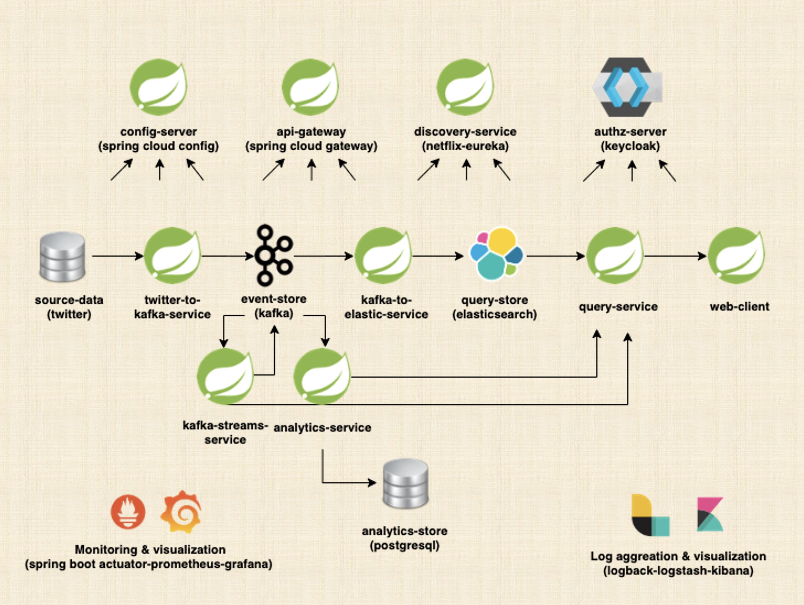

# Event-Driven-Microservices

This repository contains the source code written for the Udemy course "Event-Driven Microservices" by Ali Gelenler. The course is focused on building a distributed system using Spring Boot, Apache Kafka, and Elasticsearch.

System Architecture:

 The project is a comprehensive example of a microservices architecture, developed using the latest software platforms, technologies, libraries, and tools. It demonstrates best practices, applies microservices patterns, and utilizes Java, Spring Boot, Spring Cloud, Spring Security, Kafka, and Elasticsearch. Additionally, the course covers Event sourcing and Event-driven services using Kafka as the event store.

 Key features of the project include:
* Developing cloud-ready microservices with Spring Boot, Spring Cloud, and Docker
* Implementing Spring Security OAuth 2.0 and OpenID Connect protocols for Authentication and Authorization using Keycloak and JWT
* Messaging between microservices using Apache Kafka
* Monitoring microservices using Spring Boot Actuator, Prometheus, and Grafana
* Implementing various microservices patterns such as Externalized Configuration, CQRS, API versioning, Service Registration and Discovery, API Gateway, Circuit Breaker, Rate Limiting, and Client-Side Load Balancing
* Utilizing different Spring Data dependencies for communication with data stores, such as Spring Data JPA with PostgreSQL, Spring Data Elasticsearch, and Spring Kafka
* Documenting APIs with OpenAPI 3 specification
* Applying HATEOAS (Hypermedia as the Engine of Application State) in REST APIs with Spring HATEOAS
* Reactive development with Reactive Spring, WebFlux, WebClient, and Reactive Thymeleaf